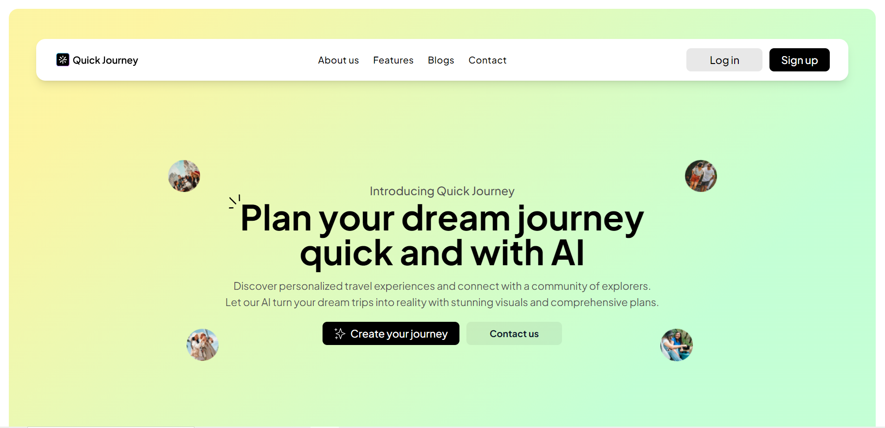

<div align="center">

  <h1 align="center">Quick-Journey</h1>

  Plan your dream journey
quick and with AI

<br/>
☑ Preview
<br/>
<a href="https://quick-journey-k4g8u7vw7-ayshenms-projects.vercel.app"><strong> 📺 Live</strong></a>


  

</div>

<br />
<div align="center">


</div>

<br>

### ☑ Contact

If you want to contact me, you can reach me over  [Linkedin](https://www.linkedin.com/in/ayshen-mirzayeva-462077167/)

<br>


<br>

### ☑ Creators

The project got prepared by collaborative actions of [Aishan](https://github.com/ayshenm)

<br>

# <div align="center">
  
#   
#   
#   
# [](https://twitter.com/sahil_salahli)
#   [](https://youtube.com)
#   

# </div>


This project is built using Node.js and serves a web application via an Nginx server.

## Prerequisites

- Docker
- Docker Compose

## Deployment

Follow the steps below to build and deploy the application using Docker and Docker Compose.

### Step 1: Build the Docker Image

First, build the Docker image by running the following command:

```sh
docker build -t quick-journey .
```

### Step 2: Start the Services

Next, use Docker Compose to start the services defined in the docker-compose.yml file:

```sh
docker-compose up -d
```

- The -d flag runs the containers in detached mode.

> alternative
>
> docker-compose up --build -d

## Accessing the Application

Once the services are up and running, you can access the application in your web browser at [http://localhost:3010](http://localhost:3010).

## Configuration

- **Nginx Configuration**: Ensure that the `nginx.conf` file is located in the root of your project directory and is correctly configured for your application.
- **Ports**: The application is set to run on port 3010 of your host machine, mapped to port 80 of the Nginx container.

## Stopping the Services

To stop the services, run:

```sh
docker-compose down
```


